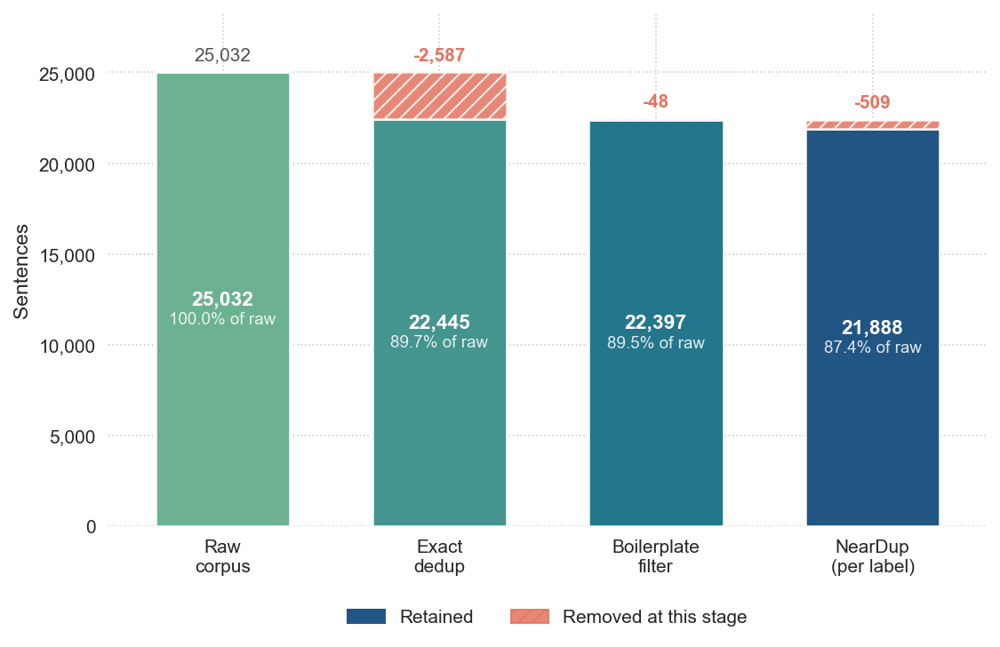
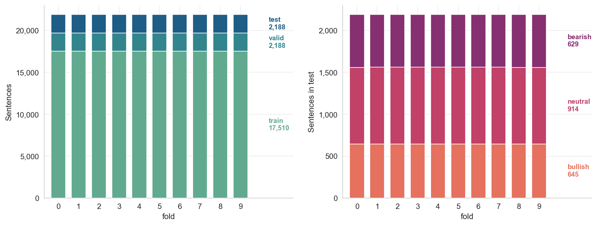
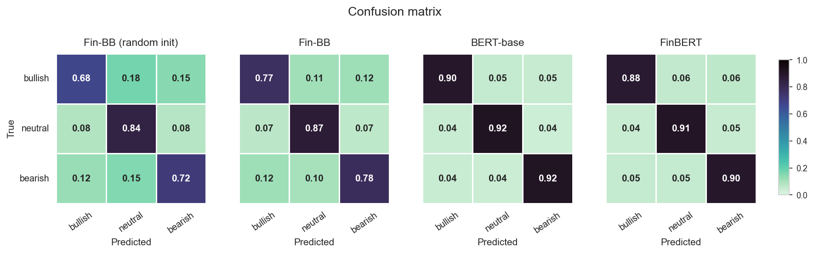
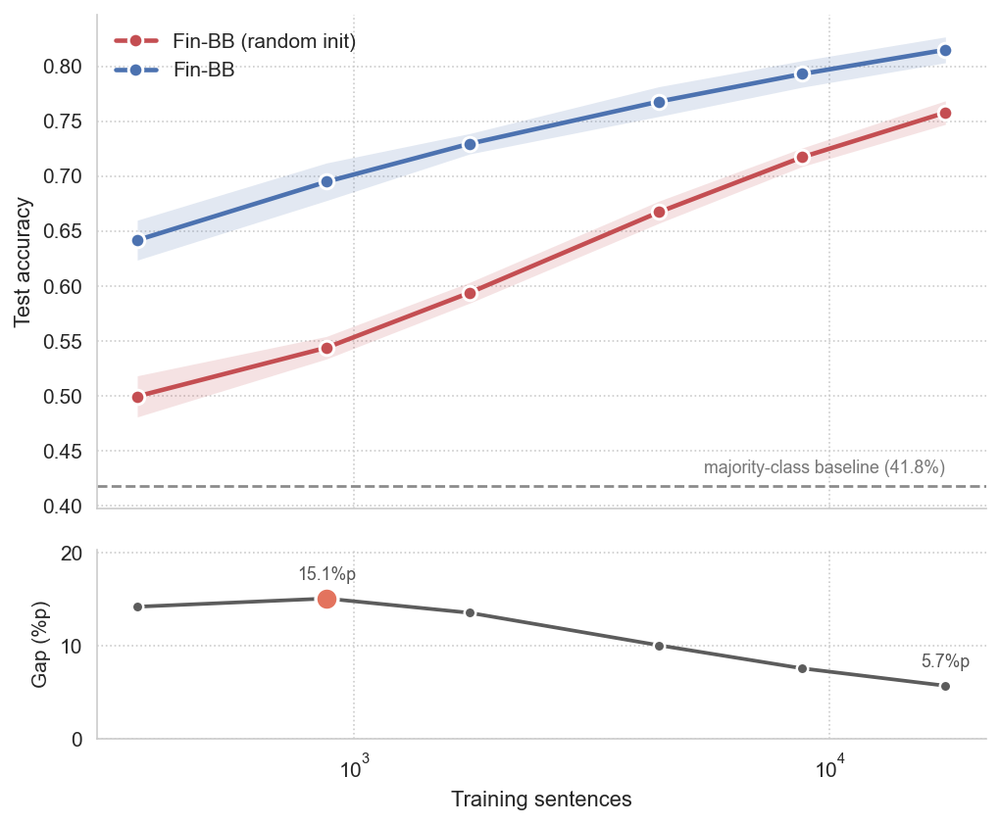
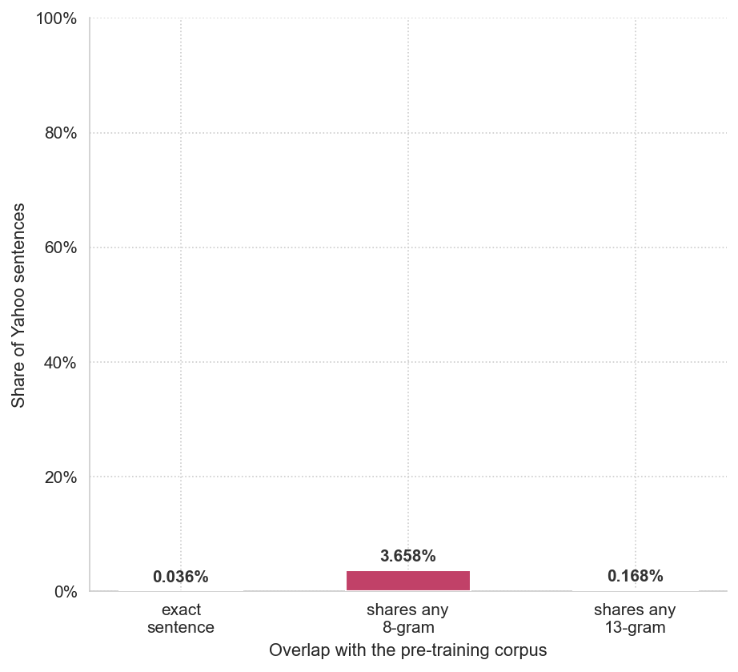
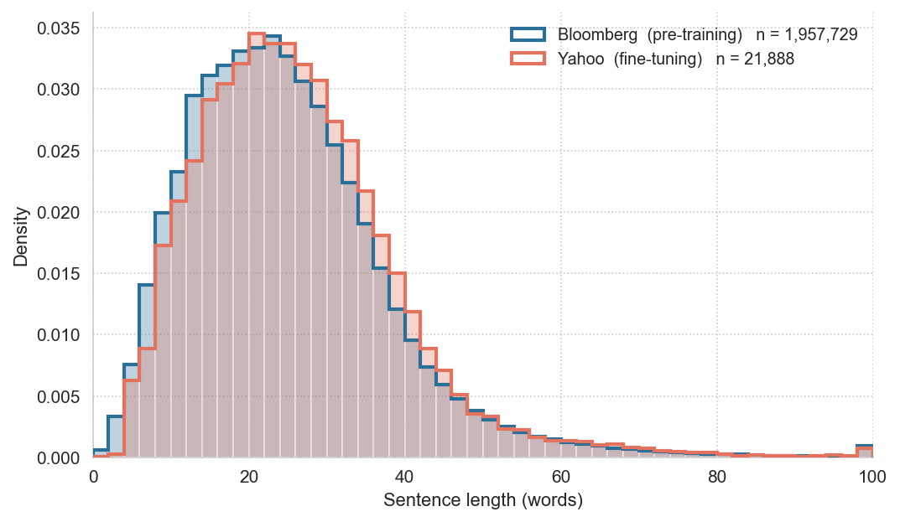
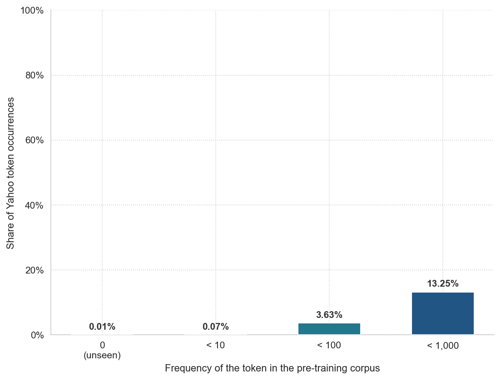
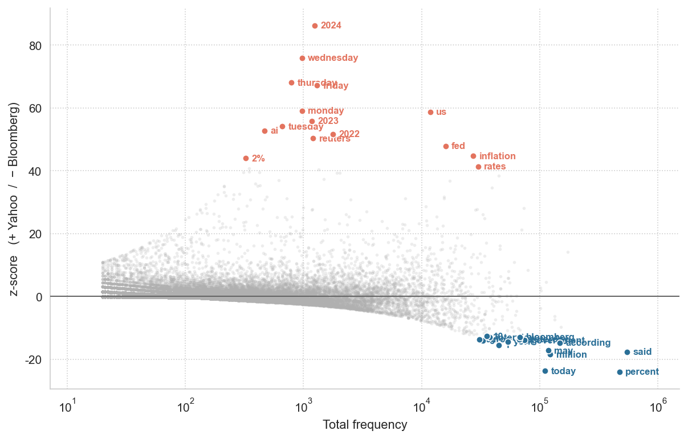
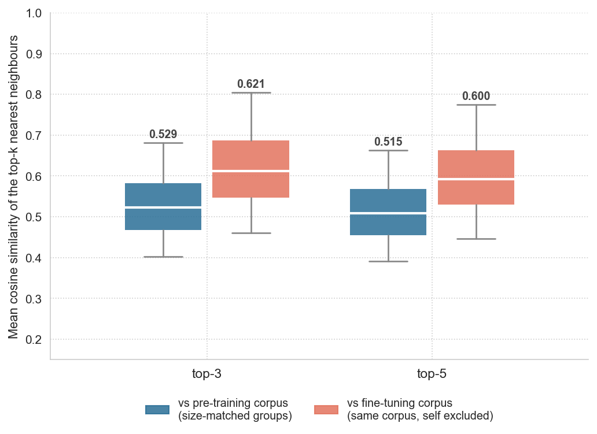
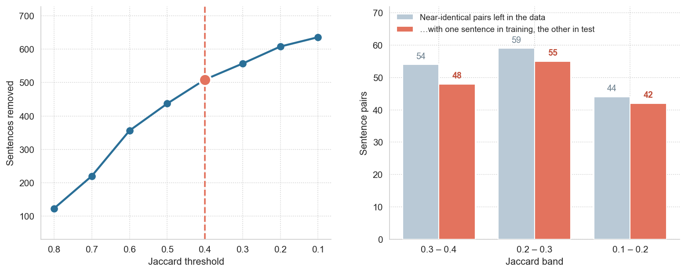

## 1. 프로젝트 개요


프로젝트의 목표는 미국 증시 관련 뉴스 문장을 입력받아, 문장에 나타난 시장 방향성을 **bullish(강세), neutral(중립), bearish(약세)**의 세 범주로 분류하는 SLM을 구축하고, financial news만을 사용해 pretrained model이 동일한 도메인의 sentence classification 성능에 미치는 영향을 분석하여 domain pretraining의 효과를 검증하는 것이다.

stock news는 시간적 맥락에 영향을 받는다. 구체적으로 기업의 실적, 금리, 물가, 투자자의 기대 등은 시간에 따라 변화하며, 뉴스의 의미와 시장에 미치는 영향 역시 이러한 context에 따라 달라질 수 있다. 예를 들어 실적이 증가했다는 사실만으로 시장의 긍정적인 반응을 단정할 수는 없으며, 당시의 기대 수준을 충족했는지까지 고려해야 한다. 

그러므로, 이러한 특성을 가진 financial news를 다룰 때에는 데이터의 domain뿐 아니라, 해당 데이터가 어느 시기의 시장 환경을 반영하고 있는지도 고려할 필요가 있다.

한편, 문장에 표현된 방향성을 분류하는 task에서는 시기가 달라지더라도 공통적으로 활용할 수 있는 언어적 패턴이 존재할 가능성이 있다. 주가 상승과 하락, 실적의 예상 상회와 하회 등을 나타내는 표현은 서로 다른 시기의 news에서도 반복적으로 나타날 수 있기 때문이다.

이에 pre-training data와 fine-tuning data 사이에 temporal gap이 존재하더라도, 과거 financial news에서 학습한 금융 어휘와 표현이 이후 시기의 동일한 domain에 대한 sentence classification에도 유용한지​를 확인하기 위해 다음과 같은 pre-training data와 fine-tuning data를 선택하였다. 

pre-training에 사용하는 Bloomberg data의 날짜 metadata는 **2006년 10월 21일부터 2013년 11월 26일**까지이며, 대부분의 기사는 2010~2013년에 해당한다. fine-tuning에 사용하는 Yahoo Finance News Sentences는 데이터셋 설명에 따르면 **2023년 12월 6일부터 20일까지 수집한 기사**로 구성된다. Bloomberg의 기록된 기사 날짜와 Yahoo의 공개된 수집 기간을 기준으로 두 기간은 겹치지 않으며, 약 10년 이상의 시간적 간격이 존재한다.

이러한 temporal gap이 존재하는 조건에서, 과거 financial news에서 학습한 표현 지식이 이후 시기의 동일한 domain에 대한 sentence classification에도 유용하게 전이되는지를 확인한다. 또한 fine-tuning data size를 단계적으로 조절하여, domain pretraining의 기여가 data size에 따라 어떻게 달라지는지를 분석한다.


이를 위해 동일한 model architecture를 사용하되, **random initialization에서 학습하는 모델과 Bloomberg financial news로 pre-trained된 checkpoint에서 학습하는 모델을 비교한다.** 두 모델을 각각 **Fin-BB random init**과 **Fin-BB**로 명명한다.

동일한 architecture를 가지는 Fin-BB random init과 Fin-BB로 domain pretraining effect를 확인한다.


또한 Fin-BB를 BERT, FinBERT와 비교한다.
|  | **Fin-BB (ours)** | **BERT-base** | **FinBERT-pretrain** |
|---|---|---|---|
| **Pre-training corpus** | Bloomberg financial news | BookCorpus + English Wikipedia | Corporate Reports (10-K/10-Q) + Earnings Call Transcripts + Analyst Reports |
| **Financial-domain specific** | **Yes** | No | **Yes** |
| **Corpus size (words/tokens)** | 48.6M words / 68.4M BPE tokens | 약 3.3B words | 약 4.9B tokens |
| **Text size** | 약 0.29 GB | 약 16 GB | - |
| **Pre-training corpus scale<br>(Fin-BB 대비)** | 1× | 약 68× (word 기준) | 약 72× (token 기준) |
| **Vocabulary** | GPT-2 BPE 기반, 50,359 | WordPiece, 30,522 (general-domain) | FinVocab WordPiece, 30,873 (financial-domain) |
| **Parameters** | 약 44.9M (encoder + classification head) | 약 110M | 약 110M |
| **Pre-training amount** | 40 epochs | 1M steps | 1M iterations |

- BERT 원 논문은 corpus를 약 3.3B words로 제시하며, 약 16 GB라는 값은 이를 설명하는 후속 문헌에서 흔히 제시되는 규모이다.
- FinBERT FinVocab은 original BERT code와 BERT-Base와 동일한 configuration을 사용해 from scratch로 학습되었다. 
- BERT는 word count, FinBERT는 token count를 기준으로 보고되어 있으며 tokenizer도 서로 다르므로, 이 값을 모델 간 완전히 동일한 단위의 corpus size ratio로 해석해서는 안 된다.

BERT는 Fin-BB보다 model size와 pre-training corpus가 훨씬 크지만 financial-domain data를 학습하지 않은 general-domain model이다. 반면 FinBERT는 Fin-BB보다 큰 model과 약 72배 규모의 corpus를 사용하면서, 다양한 financial communication으로 pre-trained된 finance-specific model이다. 이에 비해 Fin-BB는 두 모델보다 model size와 pre-training corpus가 모두 작으며, Bloomberg financial news만을 사용해 pre-training하였다. 이러한 비교를 통해, 제한된 model 및 corpus scale에서도 downstream task와 동일한 financial news domain에 대한 pre-training이 경쟁력 있는 sentence classification 성능으로 이어질 수 있는지를 확인하고자 한다.

이를 위해 Yahoo data에서 중복 문장과 정형문구를 정제하고, 유사 문장을 고려한 데이터 분할과 동일한 10-fold evaluation 절차를 적용한다.

---

## 2. 확장 배경
기존 실험에서는 downstream 성능에 대한 pre-training의 기여를 판단하기 어려웠다. 이를 확인하기 위해 동일한 model architecture를 사용하되 initialization만 다른 Fin-BB random init과 Bloomberg data로 pre-trained된 Fin-BB를 비교한다. random initialization 모델도 fine-tuning을 통해 classification에 필요한 패턴을 학습할 수 있으므로, pre-training의 효과는 fine-tuning data size에 따라 달라질 수 있다. 그러므로 fine-tuning에 사용하는 training data의 비율을 단계적으로 조절하고 각 조건에서 두 모델의 성능 차이를 비교하여, pre-training의 기여가 fine-tuning data size에 따라 어떻게 변화하는지 확인한다. 

이번에는 fine-tuning data에 대해 exact duplicate, boilerplate, near-duplicate를 정제한 다음에도, 남아 있는 유사 문장들을 고려하여 데이터를 분할하였다. 또한 단일 분할 결과에 따른 결과 변동을 줄이기 위해 10-fold evaluation을 수행하였다. 각 fold에서는 validation data를 기준으로 learning rate를 선택하고, 선택된 learning rate로 해당 fold의 test data에 대한 classification performance를 측정한다. 

그리고 pre-training과 fine-tuning에 사용하는 두 corpus 사이에는 약 10년의 temporal gap이 존재하지만, content overlap이 모델 성능에 영향을 주었을 가능성도 확인한다. 이를 통해 관찰된 성능이 단순한 데이터 중복에 의한 것인지, 동일한 financial news domain에서 학습한 표현의 transfer에 의한 것인지를 살펴본다.

---

## 3. 실험 질문

**pre-training과 fine-tuning에 동일한 domain의 데이터를 사용했을 때, pre-training의 효과는 downstream task에 사용되는 fine-tuning data size에 따라 어떻게 달라지는가?**

동일한 model architecture를 사용하는 Fin-BB random init과 Fin-BB를 대상으로 fine-tuning data size를 단계적으로 조절하고, 각 조건에서 두 모델의 성능 차이를 비교한다. fine-tuning data가 적은 경우에는 random initialization 모델이 classification에 필요한 패턴을 충분히 학습하기 어려울 수 있으므로, financial news pre-training을 통해 학습된 표현의 기여가 상대적으로 크게 나타날 가능성이 있다. 반면 fine-tuning data가 증가하면 random initialization 모델도 task에 필요한 패턴을 더 충분히 학습할 수 있으므로, 두 모델 간 성능 차이가 어떻게 변화하는지를 확인한다.

> Fin-BB random init`과 `Fin-BB`는 구조, 파라미터 수, 토크나이저, 데이터, fold, 학습 절차, 학습률 선택 방법이 전부 동일하고 pretrained weights 사용 여부만 다르다.

---

## 4. Datasets
[Bloomberg Financial News 120k](https://huggingface.co/datasets/genloop/bloomberg_financial_news_120k)는 약 120K 개의 라벨이 없는 document-level의 텍스트, [Yahoo Finance News Sentences](https://huggingface.co/datasets/ugursa/Yahoo-Finance-News-Sentences)는 약 25M 개의 bullish/neutral/bearish 라벨이 부여된 sentence-level의 텍스트이다. 

이번 확장에서는 기존의 pre-training checkpoint를 그대로 사용하며, exact duplicate, boilerplate, near-duplicate 정제 절차는 fine-tuning에 사용하는 Yahoo Finance classification data에만 적용한다. label mapping은 기존과 동일하게 `0=bullish`, `1=neutral`, `2=bearish`로 유지한다.

### 4.1 Text Normalization
중복 여부를 판정하기 위해 먼저 대소문자, 반복 공백, 불필요한 구두점 등의 차이를 정리한다. 적용한 규칙은 다음과 같다.
- 영문을 소문자로 변환한다.
- 소괄호와 괄호 내부의 내용을 제거한다.
- 두 개 이상 연속된 하이픈과 마침표를 공백으로 치환한다.
- 영문, 숫자, 공백 및 허용된 구두점을 제외한 문자를 공백으로 치환한다.
- 연속 공백을 하나로 합치고 문장 양끝의 공백을 제거한다.

숫자와 `%`, `$`, `+`, `-` 등의 기호는 허용 문자에 포함하여 유지하였다. 가격, 수익률, 증감률 등 금융 뉴스의 내용을 구성하는 정보를 일괄적으로 삭제하지 않기 위해서이다.

### 4.2 Exact Duplicate
동일한 문장이 train과 evaluation data에 동시에 포함되는 문제를 줄이고자 정규화된 문장들에 대해 exact duplicate를 제거하였다. 


### 4.3 정형문구 

기사 본문 중 `click here for the latest stock market news`사이트 안내 문구, 뉴스레터 구독 안내, 기자 소개 등 시장 방향성과 직접 관련되지 않은 boilerplate text를 제거하였다.

이러한 문장들은 모두 neutral label이었으며, 그대로 유지할 경우 모델이 실제 market direction을 나타내는 내용보다 특정 안내 표현과 neutral label 사이의 spurious correlation에 의존할 가능성이 있다.

### 4.4 Near Duplicate 
동일한 label을 갖는 문장 중에는 전체적인 문장 구조는 거의 동일하지만 일부 단어만 달라지는 near-duplicate가 포함될 수 있다.

먼저 5-gram jaccard similarity로 similarity가 0.4 이상인 문장 pair를 candidates로 선별하였다. 이후 candidate pair들에 대해 edit similarity를 계산하고 similarity가 0.8 이상인 경우 최종 near-duplicate로 판정하여 제거하였다.

jaccard similarity의 경우 threshold를 각각 0.7, 0.5, 0.4, 0.3을 적용하여 선별된 candidates을 확인하였다. 

0.4 이상에서는 다음과 같이 템플릿이 동일하고 수치만 다르거나 아포스트로피와 같은 미세한 표현 차이만 존재하였다.

```
J=0.795  it also tumbled 2.54% against the norwegian crown to the lowest since august 15...
         it also tumbled 2.28% against the norwegian crown to the lowest since august 15...

J=0.697  the success could boost investor confidence in methane as a potential rocket fuel...
         the success could boost investors' confidence in methane as a potential rocket fuel...

J=0.4   brent crude oil, a global benchmark for russia's main export, was down 0.5% at $76.79 a barrel
        brent crude oil, a global benchmark for russia's main export, was down 0.6% at $72.79 a barrel   

        msci's broadest index of asia-pacific shares outside japan closed 0.21% lower, while japan's...
        msci's broadest index of asia-pacific shares outside japan closed 0.22% lower, while japan's...
```

반면, 0.4 미만에서는 수치뿐 아니라 단어 선택과 문장 표현도 함께 달라지기 시작하였다.
```
J=0.394  among other stocks,      plug power fell 5.8% before the bell, as morgan stanley downgraded...
         among individual stocks, plug power slipped 4.2% before the bell as morgan stanley downgraded...
```
예를 들어 `fell`이 `slipped`으로, `other stocks`가 `individual stocks`로 변경되는 등 lexical variation이 나타났으며, 이러한 문장들은 단순한 template 반복보다는 서로 다른 표현 패턴을 제공하는 example로 판단하였다.

동일한 template의 반복은 제거하면서 표현의 다양성은 보존하기 위해, template-level duplication이 나타나는 경계인 jaccard similarity 0.4를 candidate selection threshold로 설정하였다. 이 값은 경험적으로 선택한 threshold이며, 모든 데이터셋에 적용되는 보편적인 최적값을 의미하지는 않는다.

각 문장을 tokenizer를 이용해 token sequence로 변환한 뒤, 두 token sequence 사이의 edit distance를 계산하였다.
이후 문장 길이의 차이를 보정하기 위해 edit distance를 두 sequence 중 더 긴 길이로 정규화하고, 이를 1에서 뺀 normalized edit similarity를 사용하였다.

$$\text{EditSim}(x_i,x_j)=1-\frac{\text{EditDistance}(x_i,x_j)}{\max(|x_i|,|x_j|)}$$

candidates 중 edit similarity가 0.8을 초과하는 경우에만 near-duplicate로 판정하였다. near-duplicate로 판정된 문장 pair를 edge로 연결하여 graph를 구성한 뒤, 각 connected component를 하나의 duplicate group으로 간주하였다. 각 group에서는 데이터의 원래 순서를 기준으로 가장 먼저 등장한 문장 하나만 유지하고, 나머지 문장은 제거하였다.

<p align="center">
  
</p>

전체 정제 과정에서 원본의 **12.56%**를 제거하였다. class별 구성은 다음과 같다.
| class | 정제 전 문장 수 | 정제 전 비율 | 정제 후 문장 수 | 정제 후 비율 |
|---|---:|---:|---:|---:|
| bullish | 7,230 | 28.88% | 6,451 | 29.47% |
| neutral | 10,584 | 42.28% | 9,146 | 41.79% |
| bearish | 7,218 | 28.84% | 6,291 | 28.74% |
| **전체** | **25,032** | **100%** | **21,888** | **100%** |


다만 이 절차만으로 모든 의미적 중복이나 유사 문장이 완전히 제거되는 것은 아니다. 설정한 similarity threshold보다 낮은 구간에도 내용적으로 유사한 문장이 남아 있을 수 있기 때문이다. 따라서 정제 이후에도 Jaccard similarity가 0.4 이상인 문장 pair는 data split 단계에서 동일한 similarity group으로 묶어 처리하였다. 구체적인 grouping 및 split 방식은 실험 및 평가 설계에서 설명한다.

---

## 5. Model 
Fin-BB의 pre-training에는 T5의 encoder–decoder architecture와 span corruption objective를 사용하였다. Bloomberg financial news를 이용한 pre-training stage에서는 encoder와 decoder를 모두 학습하여 masked span을 복원하도록 하였다.

예측 대상은 sentinel tokens로 교체된 부분이기 때문에, 타겟 시퀀스의 길이가 줄어들고 이에 따른 계산 비용도 절감된다. 
<p align="center">
  
</p>
이러한 noising 처리는 RoBERTa의 dynamic masking 전략을 적용하여 학습 시점에 동적으로 생성되도록 구현하였다.


> sentence classification에서는 pre-trained encoder를 사용하고, encoder output 위에 별도의 classification head를 연결하여 fine-tuning을 진행한다.

> 입력 문장을 `bullish`, `neutral`, `bearish`의 세 개의 고정된 class 중 하나로 분류하는 문제이므로, output sequence를 autoregressive하게 생성하는 decoder가 반드시 필요하지 않다. encoder가 입력 문장의 contextual representation을 생성한 뒤 classification head가 이를 세 class의 logits으로 변환하는 것으로 task를 수행할 수 있다. 또한, decoder를 제외함으로써 downstream stage에서 사용하는 parameter 수와 computation을 줄일 수 있다.encoder–decoder model의 parameter 수는 약 69.84M이었으며, encoder-only model은 약 44.9M이다. 프로젝트에서는 encoder representation을 classification에 활용하지만, encoder–decoder 전체를 사전학습시켰기 때문에 이후 다양한 text-to-text task에 활용할 수 있다. 

T5는 original Transformer의 absolute positional encoding 대신 relative position bias를 attention score에 직접 반영한다. Query와 key의 내적으로 계산된 attention logit에 두 token 사이의 relative position에 대응하는 학습 가능한 scalar bias를 더한다. Relative distance는 여러 개의 position bucket으로 구분되며, 가까운 token 간 거리는 세밀하게 표현하는 반면 거리가 멀어질수록 여러 distance를 하나의 bucket으로 묶는다. T5에서는 이러한 bucket의 범위를 logarithmic하게 증가시키며, 일정 거리 이상에서는 동일한 relative position bias를 공유한다. 이러한 방식은 고정된 absolute position embedding에 의존하지 않기 때문에 다양한 sequence length를 처리하는 데 구조적으로 유연하다.

Fin-BB는 T5-small과 동일하게 encoder와 decoder를 각각 6 layers로 구성하고, hidden dimension $d_{\text{model}}=512$, FFN intermediate dimension $d_{\text{ff}}=2{,}048=4d_{\text{model}}$, attention head 수는 8, head별 key/query/value dimension $d_{\text{kv}}=64$를 사용한다.

| Configuration | Value |
|---|---:|
| Number of Encoder Layers | 6 |
| Number of Decoder Layers | 6 |
| Hidden Dimension ($d_{\text{model}}$) | 512 |
| FFN Intermediate Dimension ($d_{\text{ff}}$) | 2,048 |
| Number of Attention Heads | 8 |
| Dimension per Attention Head ($d_{\text{kv}}$) | 64 |
| Vocabulary Size | 50,359 |

Encoder의 각 layer는 self-attention과 FFN으로 구성되며, decoder의 각 layer는 causal self-attention, encoder output을 참조하는 cross-attention, FFN으로 구성된다. 각 sublayer에서는 입력에 먼저 normalization을 적용한 뒤 연산을 수행하는 Pre-LN 구조를 사용하며, sublayer의 출력에는 dropout과 residual connection을 적용한다.

normalization에는 T5에서 사용하는 RMSNorm 형태의 Pre-LN 구조를 적용하였다. 

financial news에는 ticker symbol뿐 아니라 가격, 수익률, 등락폭 등 다양한 숫자와 결합된 %, $, -, + 등의 기호가 빈번하게 등장한다. 이러한 표현을 안정적으로 tokenization하기 위해 GPT-2 tokenizer의 byte-level BPE를 사용하였다. Byte-level BPE는 256개의 byte 값을 기본 단위로 사용하므로 임의의 문자열을 byte sequence로 표현할 수 있으며, 일반적인 character-level vocabulary와 달리 unknown token 없이 모든 word를 tokenization할 수 있다. 

GPT-2의 기본 vocabulary size는 50,257이다. Fin-BB에서는 여기에 span corruption을 수행하기 위한 sentinel token 등의 special token을 추가하여 최종 vocabulary size를 50,359로 확장하였다. sentinel token은 input에서 제거된 span의 위치를 표시하고 decoder가 해당 span을 복원할 수 있도록 하는 역할을 한다.

vocabulary size는 50,359이며, encoder와 decoder의 input embedding 및 output projection 사이에 weight tying을 적용하여 parameter 수를 줄였다.

pre-training에 사용한 encoder–decoder model의 parameter 수는 69,842,432개로, 약 69.84M 규모이다.

Adafactor optimizer와 inverse square root scheduler를 사용하며, 40 epochs, batch size=64, learning rate 0.01, warmup steps는 total training steps의 약 10%, gradient clipping 0.1을 적용하였고, 학습에는 mixed precision을 사용한다. 그리고 validation perplexity가 8회 개선되지 않을 경우 학습을 중단하도록 설정하였다.
> pre-training data는 총 106,917개이며, batch size는 64로 설정하였다. 이에 따라 epoch당 1,670개의 batch가 구성되고 37개의 sample이 남는다. 남은 37개의 sample에는 `drop_last=True`를 적용하여 제외시켰다. 1,670개 batch에 40 epochs 동안 학습하므로 전체 training steps는 66,800이 된다. 이 중 10%에 해당하는 6,680 steps를 warm-up steps로 설정하였다.

NVIDIA A100 80GB에서 pretraining을 수행했으며 결과는 다음과 같다.  
<p align="center">
  
</p>

## 6. Slim Attention
decoder의 autoregressive generation에는 [Slim Attention](https://arxiv.org/abs/2503.05840)의 K-cache 방식을 구현하였다. 

일반적인 autoregressive inference에서는 이전 token에 대해 이미 계산한 key $K$와 value $V$를 메모리에 저장하고 재사용하는 KV-cache를 사용한다. 이를 통해 새로운 token을 생성할 때 이전 token의 $K$와 $V$를 반복해서 계산하는 것을 방지할 수 있다. 그러나 새로운 token이 생성될 때마다 해당 token의 $K$와 $V$가 cache에 추가되므로, KV-cache의 크기는 sequence length에 따라 선형적으로 증가한다. 

Slim Attention은 key로부터 value를 재구성할 수 있다는 관계를 이용하여 V-cache를 제거하고 K-cache만 유지하는 방법을 제안한다.

nput을 $X$라고 하면, $K=XW_K, V=XW_V$로 계산된다. 

일반적인 MHA에서 $W_K$가 invertible하다고 하면, $X=KW_K^{-1}$로 나타낼 수 있으므로 $V$는 $V=K(W_K^{-1}W_V)$로 표현할 수 있다. 

여기서 $W_{KV}=W_K^{-1}W_V$를 inference 이전에 미리 계산해 두면, $V=KW_{KV}$로 계산하면 되기 때문에 inference 시 $V$를 별도로 cache할 필요가 없다.

그러므로 $K$와 $V$를 모두 저장하는 standard KV-cache 대신 K-cache만 유지하면 된다. 이론적으로 MHA 대비 KV-cache를 2배 줄일 수 있다. 이 방식을 decoder self-attention에 적용한다. 

> 이 변환은 standard attention과 수학적으로 동일하므로 별도의 retraining이나 accuracy loss를 요구하지 않는다. generate phase에서는 $V$를 다시 계산하기 때문에 standard KV-cache 방식보다 추가 computation이 발생할 수 있다. 그러나 Slim Attention은 $\text{softmax}\left(\frac{QK^\top}{\sqrt{d_k}}\right)(KW_{KV})$를 $\left[\text{softmax}\left(\frac{QK^\top}{\sqrt{d_k}}\right)K\right]W_{KV}$로 재배치하여 계산한다. 이를 통해 V-cache에 대한 memory read를 제거하면서 추가 연산을 줄일 수 있다.

---

## 7. Experiments 

### 7.1 Setup

#### 7.1.1 유사 문장과 클래스 분포를 고려한 10-fold 분할

앞서 near-duplicate에서는 동일한 label을 가지면서 5-gram jaccard similarity가 0.4 이상이고 edit similarity가 0.8을 초과하는 문장 쌍을 대상으로 수행하였다. 그러므로, 정제 후에도 일부 표현을 공유하지만 이 조건들을 충족하지 않아 유사 문장들이 남을 수 있다.

실제로 정제된 데이터에는 jaccard similarity가 0.4 이상인 문장 쌍이 272개 존재하였다. 이러한 문장들이 train set과 test set에 나뉘어 포함되면, training에서 접한 표현과의 중첩으로 인해 test 성능이 높게 추정될 가능성이 있다.

유사 문장이 서로 다른 분할에 배치되는 것을 방지하기 위해 group-based split을 적용하였다. 구체적으로 jaccard similarity가 0.4 이상인 문장 쌍을 graph로 연결하고, graph의 connected component를 하나의 group으로 정의하였다. 

또한 유사 문장 그룹에 속한 문장들을 train, test set에 분할하지 않으면서, 각 fold의 class distribution이 가능한 한 전체 데이터의 distribution과 유사하도록, 10개의 블록에 group을 greedy하게 배정하였다. 

먼저 각 group의 class별 sample 수를 계산하고, class distribution의 표준편차가 큰 group부터 순차적으로 처리하였다. 특정 class에 많이 치우친 group은 나중에 배정할수록 블록 간 class 균형을 맞추기 어렵기 때문이다. 

각 group에 대해 10개 블록에 각각 임시로 배정한 뒤, 블록별 클래스 문장 수를 전체 데이터의 해당 클래스 문장 수로 나누어 class별 배분 비율을 계산하였다. 

이후 각 class의 배분 비율에 대한 블록 간 표준편차를 구하고, 세 class의 표준편차를 평균하여 배정 점수로 사용하였다. 해당 점수가 가장 작은 블록에 group 전체를 배정하였으며, 동점 처리에서는 현재 문장 수가 적은 블록을 우선 배정하였다. random shuffle 없이 고정된 처리 순서로 수행하여 동일한 입력에 대해 동일한 분할이 생성되도록 하였다. 

이 방식을 통해 분할된 10-fold는 다음과 같다. 

<p align="center">
  
</p>

이 방식은 그룹 보존을 제약으로 두고 각 단계의 클래스 불균형을 줄이는 휴리스틱이며, 최적의 배정을 보장하지는 않는다.

모델 간 성능 차이가 데이터 분할이 아니라 모델에서 비롯되도록, 모든 실험에서 모델들이 동일한 10-fold 분할을 사용한다.

### 7.1.2 Learning Rate 탐색

learning rate는 각 fold에서 $\{2e-5, 5e-5, 1e-4, 3e-4 \}$ 중 독립적으로 선택하였다. 실험의 fold 분할에서는, 각 fold에서 validation에 사용되는 block은 다른 fold에서는 test block으로 사용되므로, 모든 fold의 validation 결과를 합쳐 하나의 learning rate를 선택하면 일부 test data가 간접적으로 hyperparameter selection에 관여하게 된다.

이를 방지하기 위해 fold $k$의 learning rate는 해당 fold의 train/validation data만을 사용하여 선택하였다.

이 단계에서는 해당 fold의 test performance를 계산하지 않았다. learning rate를 선택한 이후에만 해당 fold의 test set을 이용하여 최종 성능을 측정하였다.

learning rate 선택 결과는 모델별로 뚜렷한 차이를 보였다. Fin-BB random init은 대부분의 fold에서 `3e-4`, pre-trained Fin-BB는 `5e-5`, BERT 계열 모델은 주로 `2e-5`를 선택하였다. 

즉, 이 실험의 설정에서는 random initialization model이 pre-trained model보다 상대적으로 큰 learning rate를 필요로 한다. 이러한 차이를 고려하지 않고 모든 모델에 동일한 learning rate를 적용할 경우, random initialization model이 충분히 최적화되지 않아 상대적으로 불리한 성능을 보일 수 있다. 그 결과 random initialization과 pre-trained model 간 성능 차이가 실제 pre-training의 효과보다 크게 나타나, pre-training의 기여가 과대평가될 가능성이 있다.

---

## 8. Results

### 8.1 Model Performance Comparison

| Model | Parameters | Test Accuracy | Test Macro-F1 |
|---|---:|---|---|
| Fin-BB random init | 44.9M | 0.7578 ± 0.0107 | 0.7483 ± 0.0119 |
| **Fin-BB** | 44.9M | **0.8149 ± 0.0117** | **0.8079 ± 0.0116** |
| FinBERT | 109.8M | 0.8966 ± 0.0079 | 0.8940 ± 0.0075 |
| BERT-base | 109.5M | **0.9115 ± 0.0049** | **0.9096 ± 0.0045** |

Fin-BB는 random initialization 대비 Accuracy와 Macro-F1가 각각 약 7.53%, 7.96%의 향상을 보였다.

두 모델은 동일한 architecture와 parameter size를 사용하고 pre-training 여부만 다르므로, 이 결과는 Bloomberg financial news를 이용한 pre-training이 Yahoo Finance sentence classification에 유의미한 성능 이점을 제공했음을 시사한다. 특히 두 corpus 사이에 약 10년의 temporal gap과 source difference가 존재함에도 성능 향상이 나타났다는 점에서, 과거 financial news에서 학습한 표현이 이후 시기의 동일 domain classification에도 활용될 수 있음을 확인하였다.

반면 전체 모델 중에서는 BERT-base가 가장 높은 성능을 보였다. BERT-base는 Test Accuracy 0.9115, Macro-F1 0.9096을 기록했으며, FinBERT 역시 각각 0.8966, 0.8940으로 Fin-BB보다 높은 성능을 보였다. 이는 Fin-BB가 BERT 계열보다 약 2.4배 작은 model size와 훨씬 적은 pre-training corpus를 사용한다는 점을 고려할 필요가 있다. 

한편, finance-specific model인 FinBERT도 general-domain BERT보다 우수하지는 않았다. BERT-base가 FinBERT보다 Test Accuracy에서 1.49 percentage points, Macro-F1에서 1.56 percentage points 높은 성능을 기록하였다. 이는 financial-domain pre-training 자체만으로 downstream performance가 결정되는 것은 아님을 보여준다. pre-training corpus와 downstream dataset 사이의 특성 차이, vocabulary, pre-training procedure 등 여러 요인이 함께 영향을 미칠 수 있으므로, BERT와 FinBERT의 성능 차이를 domain pre-training의 효과 하나만으로 해석해서는 안 된다. 


아래 그림은 각 모델의 confusion matrix이다. 

<p align="center">
  
</p>

Fin-BB random init과 Fin-BB를 비교하면, pre-training 이후 세 class 모두에서 분류 성능이 향상되었다.
특히 random initialization model에서는 bullish를 neutral로 분류하는 비율이 0.18, bearish를 neutral로 분류하는 비율이 0.15였으나, Fin-BB에서는 각각 0.11, 0.10으로 감소하였다. 이는 Bloomberg financial news를 이용한 pre-training이 bullish와 bearish와 같이 market direction이 명확한 문장을 neutral로 잘못 분류하는 오류를 줄이는 데 기여했음을 시사한다. 다만 Fin-BB에서도 bearish를 bullish로 분류하는 비율은 0.12로 random initialization과 동일하게 나타나, pre-training이 모든 유형의 class confusion을 동일하게 감소시키지는 않았다.

BERT-base와 FinBERT는 세 class 모두에서 0.88–0.92 수준의 높은 대각선 값을 보여 Fin-BB보다 전반적으로 안정적인 분류 성능을 나타냈다. BERT-base는 bullish 0.90, neutral 0.92, bearish 0.92로 가장 균형 잡힌 결과를 보였으며, FinBERT도 각각 0.88, 0.91, 0.90을 기록하였다. 이는 앞서 Accuracy와 Macro-F1에서 BERT 계열 모델이 더 높은 성능을 보인 결과와도 일치한다.

### 8.2 Pre-training Benefit across Fine-tuning Data Sizes

아래 그림과 표는 fine-tuning에 사용하는 Yahoo data의 양을 2%에서 100%까지 늘렸을 때 Test Accuracy가 어떻게 변하는지 보여준다. 

<p align="center">
  
</p>

| Fine-tuning Data Fraction | Training Sentences | Fin-BB (random init) Test Accuracy | Fin-BB Test Accuracy | Accuracy Gap (p.p.) |
|---:|---:|---:|---:|---:|
| 2% | 350 | 0.4995 | 0.6416 | +14.22 |
| **5%** | **875** | 0.5438 | 0.6948 | **+15.10** |
| 10% | 1,751 | 0.5938 | 0.7294 | +13.56 |
| 25% | 4,377 | 0.6672 | 0.7678 | +10.06 |
| 50% | 8,755 | 0.7172 | 0.7929 | +7.58 |
| 100% | 17,510 | 0.7578 | 0.8149 | +5.71 |

**fine-tuning data size가 작을수록 Fin-BB와 random initialization 모델 사이의 성능 차이가 크게 나타났다.** 50문장(2%)에서는 Fin-BB가 random init보다 14.22% 높은 accuracy를 보였으며, 875문장(5%)에서 그 차이가 15.10%로 가장 크게 나타났다. 이후 fine-tuning data가 증가함에 따라 gap은 점차 감소한다. 이는 labeled data가 충분하지 않은 환경에서 pre-training의 이점이 상대적으로 크게 나타나며, data가 증가할수록 random initialization 모델도 downstream task에 필요한 패턴을 학습하면서 두 모델의 성능 차이가 줄어드는 경향을 보여준다.

**pre-training은 data efficiency 측면에서도 이점을 보였다.** Fin-BB random init이 전체 17,510문장을 사용하여 달성한 accuracy를 pretrained model은 약 3.4k개의 training sentence로 달성한다. 즉, in-BB random init과 동일한 accuracy 수준에 도달하는 데 필요한 labeled data가 약 5.1배 적다. 

또한, class별 recall을 살펴보면 low-data setting에서 두 모델의 차이가 더욱 뚜렷하게 나타났다.

| Fine-tuning Data Fraction | model | bullish | neutral | bearish |
|---|---|---|---|---|
| 2% | random init | 0.346 | 0.695 | 0.373 |
| 2% | Fin-BB | 0.539 | 0.774 | 0.554 |
| 100% | random init | 0.679 | 0.837 | 0.722 |
| 100% | Fin-BB | 0.772 | 0.867 | 0.783 |

350문장에서 random initialization 모델의 recall은 bullish 0.346, neutral 0.695, bearish 0.373이었던 반면, Fin-BB는 각각 0.539, 0.774, 0.554를 기록하였다. pre-training에 따른 recall 증가는 neutral보다 bullish와 bearish에서 상대적으로 크게 나타났다. 이는 low-resource downstream setting에서 in-domain pre-training이 market direction이 명확한 class를 구분하는 데 특히 도움이 되었을 가능성을 시사한다.

종합하면, **pre-training의 효과는 fine-tuning data가 제한된 환경에서 가장 크게 나타났으며, data size가 증가함에 따라 그 이점은 감소하는 경향을 보였다.** 또한 low-data setting에서의 성능 향상은 특히 bullish와 bearish class의 recall 개선에서 두드러졌다. 이는 financial news pre-training이 적은 labeled data로 downstream sentence classification을 수행할 때 유용한 representation을 제공할 수 있음을 시사한다.


### 8.3 사전학습 효과의 원천: 코퍼스 분석 -> 영어로
관찰된 성능 향상이 pre-training과 fine-tuning corpus 간의 content overlap에 의해 설명될 가능성을 점검하기 위해, 두 corpus가 실제로 어느 정도 유사한지 분석하였다.

#### 8.3.1 N-gram Overlap 

<p align="center">
  
</p>


fine-tuning corpus에서 pre-training corpus와 완전히 일치하는 문장은 8개(0.0365%)였으며, 하나 이상의 13-gram을 공유하는 문장도 0.168%에 불과하였다. 이는 약 10년의 temporal gap을 갖는 두 corpus 사이에 직접적인 lexical overlap이 매우 적음을 보여준다. 그러므로, Fin-BB의 성능 향상이 대규모의 직접적인 문장 중복에 의해 설명될 가능성은 낮다. 

#### 8.3.2 Sentence Length Distribution

Bloomberg corpus는 article-level data이고 Yahoo corpus는 sentence-level data이므로, 두 corpus를 동일한 단위에서 분포를 비교하기 위해 Bloomberg article을 개별 sentence로 분리하였다.

<p align="center">
  
</p>

그 결과 Bloomberg의 평균 sentence length는 24.82 words, Yahoo는 25.77 words로 약 0.95 word의 차이만 나타났다. median 역시 각각 23 words와 24 words였으며, 75th, 90th, 95th, 99th percentile에서도 두 corpus의 차이는 대부분 0–1 word 수준이었다. 이는 두 corpus가 수집 시기와 source는 다르지만, sentence length라는 surface-level characteristic에서는 매우 유사한 분포를 가진다는 것을 보여준다.

다만 n-gram overlap과 sentence length similarity만으로 semantic similarity 여부를 완전히 판별할 수는 없으므로, 이후 sentence embedding 기반 similarity 분석을 수행한다. 

#### 8.3.3 Pre-training Frequency of Fine-tuning Tokens

Yahoo fine-tuning 문장을 tokenization한 다음, 각 token이 Bloomberg pre-training corpus에 몇 번 등장했는지 확인한다. 

<p align="center">
  
</p>

fine-tuning corpus에서 등장한 토큰을 기준으로 pre-training corpus에서의 등장 빈도를 확인한 결과, 99.99%의 token occurrence가 Bloomberg pre-training corpus에서 최소 한 번 이상 관측된 토큰으로 구성되어 있었다. 즉, Yahoo 전체 token occurrence 중 99.991%는 Bloomberg에서 적어도 한 번 이상 등장한 토큰이다. 또한 86.75%는 Bloomberg에서 1,000번 이상 등장한 토큰이다.

앞선 n-gram overlap 분석에서는 두 corpus 사이의 직접적인 content overlap이 매우 제한적으로 나타난 반면, token-level 분석에서는 대부분의 fine-tuning token이 pre-training corpus에서 이미 충분히 관측된 것으로 나타났다. 즉, 두 corpus는 동일한 문장이나 긴 표현을 직접적으로 공유하는 정도는 낮지만, financial news를 구성하는 lexical basis는 상당 부분 공유하고 있다.

이러한 결과는 Fin-BB의 성능 향상이 동일한 문장의 직접적인 memorization보다는, pre-training 과정에서 반복적으로 접한 financial-domain vocabulary와 표현을 downstream task에서 활용했을 가능성을 보여준다.

#### 8.3.4 Lexical Comparison using Log-Odds Ratio

두 corpus가 공유하는 vocabulary 안에서도 단어의 사용 비율에는 차이가 존재할 수 있으므로, Bloomberg와 Yahoo에서 상대적으로 더 자주 사용되는 단어를 비교하였다. 단순 frequency를 통한 비교는 두 corpus의 크기 차이에 크게 영향을 받기 때문에, informative Dirichlet prior를 적용한 log-odds ratio를 사용하였다. 이 방법은 corpus별 word frequency의 상대적 차이를 비교하면서 rare word에 의한 불안정성을 완화하며, 각 단어의 차이를 z-score로 나타낸다.

분석에는 Bloomberg의 1,957,729개 sentence와 Yahoo의 21,888개 sentence를 사용하였다. 각 sentence를 whitespace 기준으로 word 단위로 분리하고 punctuation을 정리한 뒤, English stopword를 제거하였다. 두 corpus를 합쳐 20회 미만 등장한 word는 제외하였으며, 최종적으로 50,595개 word를 비교하였다.

<p align="center">
  
</p>

그림의 x축은 Bloomberg와 Yahoo를 합쳤을 때 total word frequency를 log scale로 나타내며, y축은 Yahoo와 Bloomberg 사이의 상대적인 word usage difference를 나타내는 z-score이다. positive z-score는 해당 word가 Yahoo에서 상대적으로 더 자주 사용됨을, negative z-score는 Bloomberg에서 상대적으로 더 자주 사용됨을 의미한다. 0에 가까울수록 두 corpus에서의 상대적 사용 비율 차이가 작다.

Yahoo에서 상대적으로 두드러진 word에는 `2023`, `2024`, 요일 표현인 `wednesday`, `thursday`, `friday`와 함께 `ai`, `fed`, `inflation`, `rates`, `reuters` 등이 포함되었다. Yahoo corpus가 2023년 12월에 수집되었다는 점을 고려하면, 연도와 요일 표현은 collection period의 차이를 반영하는 것으로 볼 수 있다. 또한 `ai`, `fed`, `inflation`과 같은 단어의 상대적 증가는 해당 시기에 다뤄진 financial topics의 차이가 반영되었을 가능성이 있다.

반면 Bloomberg에서는 `percent`, `million`, `said`, `according`, `interview`, `bloomberg`, `yesterday` 등의 word가 상대적으로 더 많이 나타났다. 이러한 차이는 단순한 financial domain의 차이라기보다 news source의 writing style, 표현 방식, collection period 및 당시 다뤄진 topic의 차이가 함께 반영된 결과로 해석할 수 있다.

수집 시기와 기사 출처의 차이로 인해 상대적으로 자주 사용하는 단어에는 차이가 있다. 다만, 이 사실만으로 전체 어휘가 크게 다르다고 결론 내릴 수 없다. 

#### 8.3.4 Semantic Similarity

표면적인 lexical overlap을 넘어 두 corpus가 semantic space에서 어느 정도 유사한지를 분석하였다. 이를 위해 `all-MiniLM-L6-v2`를 사용하여 Bloomberg와 Yahoo의 sentence를 동일한 embedding space에 표현하고, cosine similarity를 계산하였다.

corpus size에 따른 영향을 줄이기 위해 Bloomberg sentence를 Yahoo와 동일한 크기인 21,888개씩 구성된 size-matched group으로 나누어 비교한다. 

총 89개의 group에 대해 각각 가장 가까운 top-$k$ sentence를 찾고, top-3와 top-5의 similarity 평균을 계산하였다. 

비교를 위해 Yahoo corpus 내부에서 자기 자신을 제외한 다른 Yahoo 문장 중 가장 유사한 top-3 및 top-5 문장을 찾고 이들의 평균 cosine similarity를 baseline으로 사용한다.

<p align="center">
  
</p>

Bloomberg pre-training corpus와 비교했을 때 평균 similarity는 top-3에서 0.529, top-5에서 0.515였다. 반면 Yahoo corpus 내부에서 자기 자신을 제외하고 가장 가까운 문장을 찾은 within-corpus baseline은 각각 0.621, 0.600이었다.

Yahoo sentence는 예상대로 같은 Yahoo corpus 안의 문장들과 더 높은 semantic similarity를 보였지만, 시기와 source가 다른 Bloomberg corpus에서도 일정 수준의 semantic similarity가 일관되게 나타났다. 이는 두 corpus가 완전히 동일한 것은 아니지만, 동일한 financial news domain에서 일정 부분 의미적 특성을 공유하고 있음을 보여준다.

또한 size-matched Bloomberg group별 top-3 mean similarity가 0.528–0.531의 좁은 범위에 나타나, 특정 Bloomberg subset에서만 높은 similarity가 발생한 것이 아니라 pre-training corpus 전반에서 유사한 수준의 semantic proximity가 일관되게 나타났음을 보여준다.

n-gram overlap이 거의 없지만, token coverage가 매우 높고, sentence embedding에서도 semantic similarity가 관찰되었다. 이러한 결과들은 Fin-BB에서 관찰된 pre-training gain은 대규모의 직접적인 content memorization만으로 설명되기 어렵고, Bloomberg financial news에서 학습한 domain-level lexical and semantic representations가 Yahoo sentence classification에 transfer되었을 가능성을 뒷받침한다.

---

## 9. Limitations

### 9.1 Sentence Ambiguity
Yahoo Finance News Sentences는 각 sentence에 bullish, neutral, bearish 중 하나의 label을 부여하는 sentence-level classification dataset이다. 그러나 실제 데이터를 확인하면 하나의 sentence 안에 긍정적 signal과 부정적 signal이 함께 포함되어 있으면서 전체 sentence에는 하나의 방향성 label이 부여된 사례가 존재한다. 예를 들어 나스닥 지수 하락과 다우 지수 상승이 같이 등장하는 문장은 bearish로 label이 되어 있다.

이러한 문장은 긍정적/부정적 clause를 분리하여 보다 fine-grained하게 다시 annotation하는 방법도 고려할 수 있다. 그러나 실험에서는 이러한 재분할과 re-labeling을 수행하지 않았다. 첫째, 본 연구의 downstream task는 원래 dataset이 정의한 sentence-level classification이므로, clause 단위로 분할하면 task 자체가 변경된다. 둘째, 예시와 같이 서로 다른 정보를 연결하는 관계 자체가 전체 sentence의 방향성을 결정하는 데 중요할 수 있으므로, clause를 분리하면 이러한 context가 손실될 수 있다. 예시의 Nasdaq Composite는 수천 개의 Nasdaq 상장 종목을 포함하는 broad-based index인 반면 Dow Jones Industrial Average는 30개 대형 우량기업으로 구성되므로, Nasdaq의 하락에 상대적으로 더 큰 의미를 부여하는 해석도 가능하다. 따라서 이러한 사례의 sentence-level label을 단순히 모순되거나 잘못된 label로 간주하기는 어렵다.

### 9.2 Residual Duplicate

<p align="center">
  
</p>

Near-duplicate filtering에서는 edit similarity를 0.8 초과로 고정하고 동일한 label을 갖는 문장에 대해 Jaccard threshold를 변화시켰다. 최종적으로 선택한 $J=0.4$에서는 509개의 문장이 제거되어 21,888개가 남았다. 그러나 $J=0.4$는 duplicate와 non-duplicate를 완전히 구분하는 경계가 아니라, 실제 문장 pair를 검토하여 정제 범위를 결정한 empirical threshold이다.

right는 이러한 정제 이후에도 남아 있는 동일 label 및 edit similarity 0.8 초과 문장 쌍을 jaccard similarity 구간별로 나타낸 것이다. $0.1 \leq J < 0.4$ 구간에서는 총 157개의 유사 문장 pair가 확인되었으며, 이 중 145 pair는 서로 다른 block에 배정되었다.

이는 $J \geq 0.4$인 유사 문장을 동일한 similarity group으로 묶어 split하더라도, threshold 아래에 존재하는 유사 문장까지 완전히 통제할 수는 없으며 split 간 residual similarity가 남을 수 있음을 보여준다. 

다만 이는 template-level overlap은 통제하면서 lexical variation은 보존하도록 설정한 threshold에 따른 결과이다. 실제 threshold 검토에서 $J\geq0.4$에서는 동일한 sentence template에 수치만 변경된 사례가 반복적으로 나타난 반면, 그보다 낮은 구간에서는 수치뿐 아니라 lexical choice와 표현도 함께 변화하였다. 따라서 본 연구에서는 이러한 문장을 별개의 example로 유지하였으며, 그 결과 낮은 수준의 residual similarity가 split 사이에 남을 수 있다는 한계가 존재한다.

### 9.3 Limited Pre-training Budget and Fine-tuning Data Range
Fin-BB의 pre-training은 convergence criterion에 의해 종료된 것이 아니라, 사전에 설정한 40-epoch training budget을 모두 사용한 시점에서 종료되었다. 따라서 현재 checkpoint의 성능이 해당 architecture와 corpus에서 도달할 수 있는 최종적인 pre-training 성능이라고 단정할 수 없다. 추가적인 pre-training을 수행할 경우 downstream performance가 더 향상되거나 plateau에 도달할 가능성이 모두 존재하므로, 본 실험에서 관찰된 pre-training gain은 40 epochs라는 고정된 training budget 아래에서의 결과로 해석해야 한다.

fine-tuning data size에 대한 분석에서 Yahoo dataset에서 사용할 수 있는 최대 training data인 17,510문장까지로 제한되었다. 100% data를 사용한 조건에서도 Fin-BB와 random initialization 사이에는 5.71%의 accuracy gap이 남아 있었으며, 관찰된 범위에서는 두 모델 모두 data size 증가에 따라 performance가 계속 향상되었다. 그러므로 더 많은 labeled data가 제공될 경우 두 모델의 performance gap이 계속 감소할지, 일정 수준에서 유지될지, 또는 다른 형태로 변화할지는 현재 실험만으로 판단할 수 없다.

---
